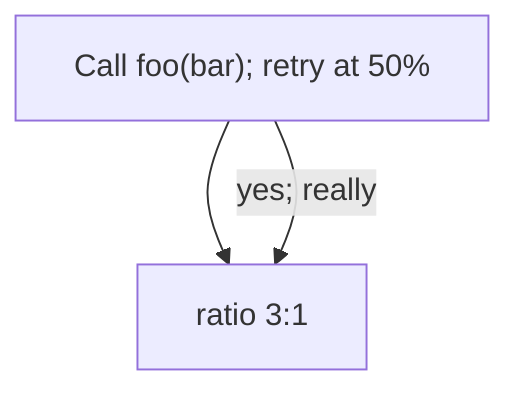
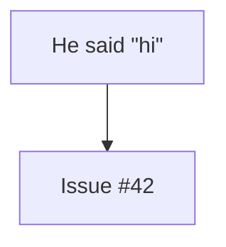
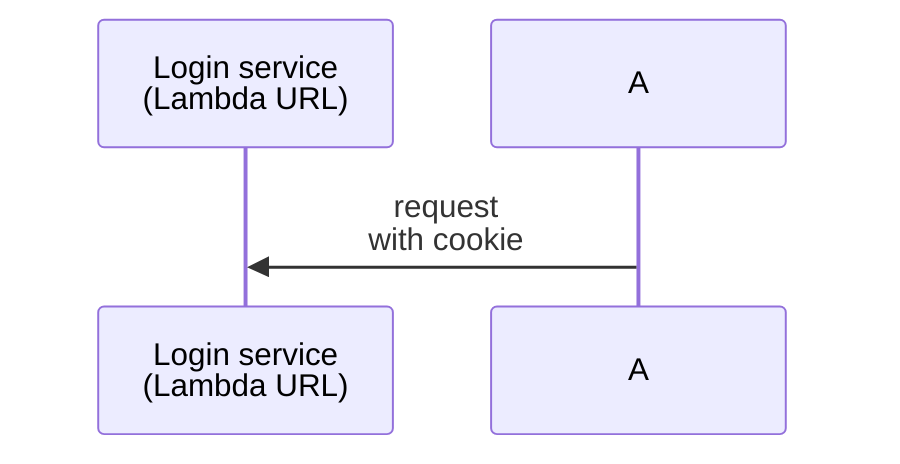

# Mermaid pitfalls & escaping

Every rule here was checked by rendering with `mmdc` (mermaid v11). When you add
a claim, verify it the same way — Mermaid's behavior is often surprising, and
stale folklore about "forbidden characters" leads to over-escaping that makes
diagrams ugly for no reason.

The headline lesson: **modern Mermaid accepts far more than people assume.**
Parentheses, colons, commas, slashes, `%`, `&`, `#`, `<`/`>`, em-dashes (`—`),
and Unicode arrows (`→`, `↔`) all render fine in ordinary label and message
text. Don't reflexively strip them. The failures below are the few that are
real — and the reason to validate rather than guess is that when they *do* bite,
the error points at the wrong place.

## The big one: `;` is a statement separator

Inside a **sequence diagram** message or note, a semicolon ends the current
statement. Mermaid then tries to parse the rest of your sentence as a new
statement, fails, and reports a parse error — often on the **wrong line**,
pointing several lines away from the actual semicolon, because the failure only
becomes unrecoverable once the parser reaches a later line.

```mermaid
sequenceDiagram
    A-->>B: login form; user authenticates   %% <-- the ; breaks this
    A-->>B: 302 to /callback
```

The reported error may be `Parse error on line 3` with a caret under the arrow on
line 3 — even though the offending `;` is on line 2. This misdirection is exactly
why eyeballing fails and rendering succeeds.

Whether a given `;` breaks depends on the surrounding lines (sometimes it renders,
sometimes it doesn't), so there is no safe way to keep it. **Fix:** replace it.

| Instead of                       | Write                                    |
| -------------------------------- | ---------------------------------------- |
| `login form; user authenticates` | `login form, user authenticates` (comma) |
| `first; second`                  | `first — second` (em-dash)               |
| two sentences in one message     | `first<br/>second` (line break)          |

The single semicolon was the *only* defect in a large, Unicode-heavy CloudFront/
Auth0 sequence diagram — changing it to a comma made the entire diagram valid.

## Escaping that actually works

### Flowchart / state / class / ER labels: wrap in double quotes

Quoting a node or edge label lets it contain almost anything — parentheses,
semicolons, `%`, `:`, punctuation:



Unquoted, some of those characters collide with shape syntax (`(`, `{`, `[`).
Quoting is the general-purpose fix — reach for it whenever a label has
punctuation.

### HTML entities for characters you can't type literally

Mermaid renders a small set of HTML entities inside labels:

| Want         | Write    |
| ------------ | -------- |
| `"`          | `#quot;` |
| `#`          | `#35;`   |
| non-break sp | `#nbsp;` |



Use `#quot;` for a literal quote inside a quoted label rather than relying on
backslash-escaping, which is not part of Mermaid's documented grammar.

### Line breaks: `<br/>`

`<br/>` (and `<br>`) work in both flowchart labels and sequence
messages/participants. This is the clean way to get multi-line text — and the
right replacement when you were tempted to cram two clauses together with a `;`.



## What is NOT a problem (don't over-escape)

Verified to render fine in ordinary text without any escaping:

- **In sequence messages:** `()`, `[]`, `:`, `,`, `/`, `?`, `&`, `=`, `%`, `"`,
  `—` (em-dash), `→` / `↔` (Unicode arrows), `#`. Example that renders cleanly:
  `A->>B: GET /cb?code=x&state=y (ratio 3:1) — done`.
- **In participant aliases:** `participant S3 as S3 (private, OAC)` is fine;
  parentheses do not need quoting there.
- **In `%%` comment lines:** anything, including `;`.
- **The identifier `end`** as a node id in a flowchart (`A --> end`) parses in
  v11, though it's clearer to avoid it.

If you find yourself HTML-escaping every parenthesis, stop — you're working from
outdated advice. Validate instead.

## Diagram-type quick reminders

- **`sequenceDiagram`** — message text is the part after `:`. It cannot be
  wrapped in quotes to neutralize characters (quotes render literally); the
  levers you have are comma/em-dash substitution and `<br/>`. Avoid raw `;`.
- **`flowchart` / `graph`** — quote any label with punctuation. Node shapes:
  `[rect]`, `(round)`, `([stadium])`, `{rhombus}`, `[[subroutine]]`,
  `[(database)]`. A stray unbalanced bracket inside an *unquoted* label is the
  usual breakage — quote it.
- **`classDiagram`** — generics use tildes: `List~int~`, not `List<int>`.
- **`stateDiagram-v2`, `erDiagram`, `pie`, `gantt`, `mindmap`** — all parse
  cleanly with the obvious syntax; when a label has punctuation, quote it (where
  the grammar allows quotes) or validate to be sure.

## When the error line looks wrong

Because of parser lookahead, a `Parse error on line N` may not be where the real
problem is. Strategy: run the validator, then if line N looks innocent, scan the
few lines *above* it for a stray `;`, an unbalanced bracket, or a shape delimiter
inside an unquoted label. Fix, re-validate, repeat.
